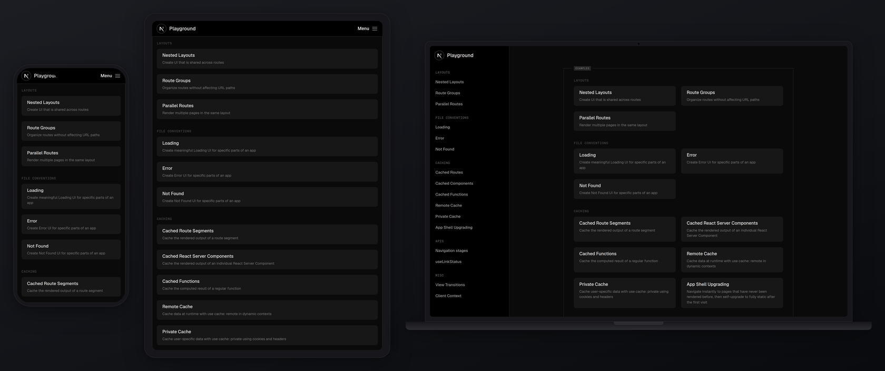
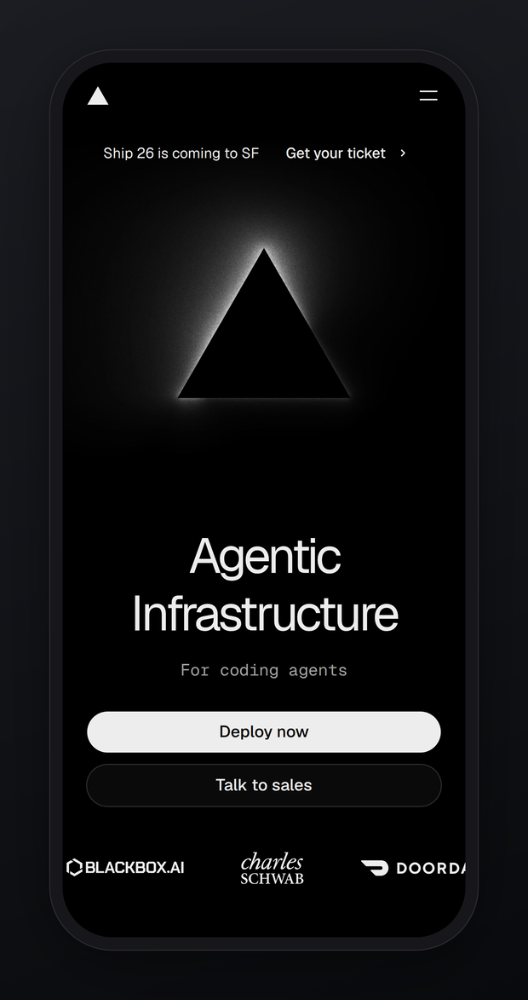
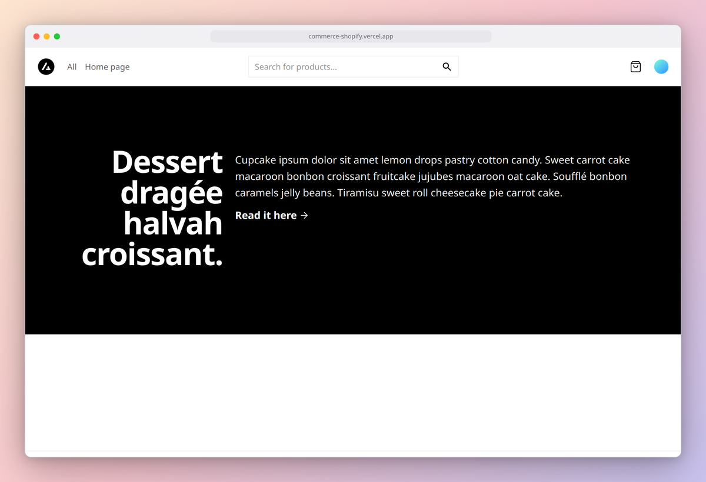

# Bezel

Device-framed, DPR-correct screenshots of a running app or URL — the
Figma-mockup-plugin workflow (device frames around app shots) without
leaving the terminal, driven by your coding agent.

Bezel captures with Playwright at exact device viewports and composites
the shot into a clean device frame generated as plain CSS (rounded
bodies, camera pill, browser chrome dots — no copyrighted vendor
artwork). Output is PNG, or a scrolled mp4/gif via ffmpeg.



## Quick start

```bash
cd skills/bezel && npm install        # playwright-core, one dependency
node scripts/bezel.mjs https://vercel.com --device iphone-15-pro --dark
```

Requires Node ≥ 18 and an installed Chrome/Chromium (playwright-core
drives it via the `chrome` channel — no browser download; set
`BEZEL_BROWSER=/path/to/chrome` to override). ffmpeg only for `--scroll`.

<p>
  
  &nbsp;
  
</p>

## Devices

| id | viewport | DPR | frame |
| --- | --- | --- | --- |
| `iphone-15-pro` | 393×852 | 3 | phone, camera pill |
| `pixel-8` | 412×915 | 2.625 | phone, punch-hole dot |
| `ipad-pro-11` | 834×1194 | 2 | tablet |
| `macbook-14` | 1512×982 | 2 | laptop with deck |
| `browser` | 1280×800 | 2 | browser chrome with URL bar |

Single-device output is 1:1 native pixels (viewport × DPR). Multi-device
rows (`--devices a,b,c`) composite at @2x.

## Options

```
--device <id>       one device (default iphone-15-pro)
--devices <a,b,c>   multi-device row
--out <file>        output path (.png; .mp4/.gif with --scroll)
--bg <value>        studio | studio-dark | sunset | ocean | none | any CSS background
--padding <px>      space around the frame (default 48)
--no-shadow         flat, no drop shadow
--dark              dark color scheme + dark studio background
--frame dark|light  frame body theme
--hide <selectors>  hide elements before capture (cookie banners etc.)
--wait <ms>         extra settle time (default 800)
--scroll            scrolled full-page capture → mp4/gif (ffmpeg)
```

## Built-in verification

Every single-device run checks itself and exits 1 on failure:

- **capture is DPR-exact** — screenshot buffer is exactly viewport × DPR;
- **output matches device spec** — output PNG dimensions equal the
  computed frame + padding size at the device DPR;
- **frame alignment** — the output is decoded (zero-dep PNG reader) and
  the screen-center pixel is compared against the raw capture.

## Tested on (real sites, 2026-09-25)

| Site | Run | Result / findings |
| --- | --- | --- |
| [vercel.com](https://vercel.com) | `iphone-15-pro --dark` | Clean; dark scheme respected; all checks pass. |
| [app-router.vercel.app](https://app-router.vercel.app) (Next.js App Router playground) | `--devices iphone-15-pro,ipad-pro-11,macbook-14 --dark` | Multi-device row, 6410×2692 @2x. |
| [commerce-shopify.vercel.app](https://commerce-shopify.vercel.app) (Vercel Commerce) | `browser --frame light`, `--scroll` mp4 | Real cookie banner hidden with `--hide '[class*="FeatureBar"]'`; product grid renders empty because the demo's Shopify backend returns no products — an app-state issue Bezel can't fix, look at your output. 61-frame scroll mp4 verified with ffprobe. |
| [github.com](https://github.com) | `browser` | Clean; checks pass. |
| taxonomy.vercel.app | `macbook-14` | **Gotcha found:** this is *not* shadcn's taxonomy; it's an unrelated app loading React from a CDN that the test network blocked → blank screen. Bezel's checks passed (the page really was blank) — always eyeball the output. |

Limitations found on real pages: sites that gate on cookies/geo render
their gated state; JS from blocked third-party CDNs renders blank (not
detectable by dimension checks); empty API-backed states look "broken"
but are app truth.

## Future mode (not in this version)

Capturing a component in isolation (Storybook/gallery URLs work today by
URL); authenticated flows via a persistent browser profile.

## Tests

```bash
cd skills/bezel && npm install && npm test
```

Covers: DPR-exact capture and output dimensions, pixel-level frame
alignment, dark scheme flip, `--hide`, deterministic multi-device
dimensions, fractional DPR (pixel-8), scroll mp4 (ffprobe-verified), and
usage errors — against a local fixture server (no external network).
Tests self-skip without Chrome.
