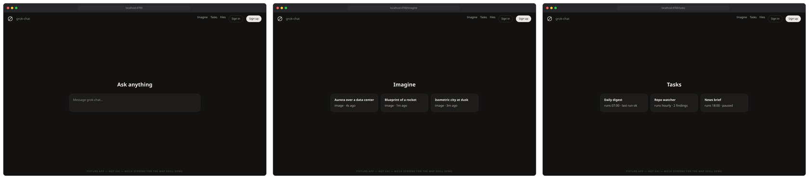
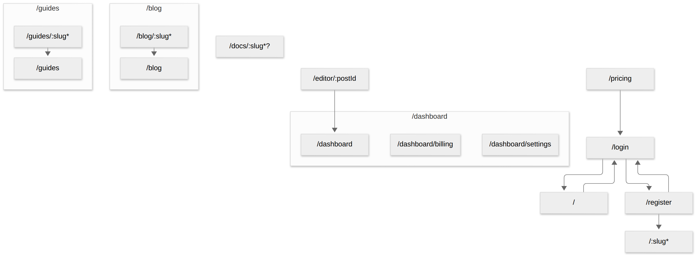

# Map

Mermaid user-flow diagrams of the screens that already exist in your
codebase — the document-the-built-flows job (Autoflow-style) done from
the router, by your coding agent, with zero dependencies.

Map walks router conventions (Next.js `app/` and `pages/`, React Router
config) and link/redirect call sites, then emits a flowchart of real
routes: grouped by segment, dynamic params labeled, redirect and
middleware edges dashed. Anything it cannot resolve is **reported with
file:line, never silently dropped**.


The map above is generated from
[`fixtures/grok-chat/`](fixtures/grok-chat/) — a small route tree
shaped like a Grok-style chat product, bundled as a demo fixture
(clearly labeled; hand-written mock screens, not xAI code).

## Quick start

```bash
node skills/map/scripts/map.mjs .          # or a monorepo app dir: apps/web
# → map-output/flow.md (Mermaid + report), map-output/flow.mmd
```

Node ≥ 18, no dependencies. GitHub renders the Mermaid block in
`flow.md` natively.

## What it understands

- **Next.js app router:** route groups `(group)`, dynamic `[param]`,
  catch-all `[...param]`, optional `[[...param]]`, parallel `@slot` and
  intercepting `(.)segment` routes (reported as in-place UI, not
  screens), private `_folders`, `route.ts` API handlers (counted, not
  screens), host-based top-level folders (`app/app.dub.co/…`),
  monorepos with several apps.
- **Next.js pages router:** nested files, `[param]`, `_app`/`_document`/
  `api` excluded; content folders that merely happen to be named
  `pages/` are not mistaken for routers.
- **React Router:** `createBrowserRouter`/`<Route path>` literals,
  relative child nesting, splats — including route strings kept in a
  central `paths` config object referenced as `paths.x.y.path`
  (the bulletproof-react pattern), resolved without an AST.
- **Edges:** `<Link href|to>`, `router.push/replace`, `navigate()`,
  `redirect()` (dashed), middleware `NextResponse.redirect` and
  `next.config` redirects (dashed, from a `middleware` node). Template
  literals (`` `/posts/${id}` ``) match dynamic routes. Expression-valued
  navigations are reported as unresolved.

Parsing is regex-based by design (zero dependencies, fast on 200-route
monorepos). It reads conventions and literals, not arbitrary JavaScript
— the unresolved report is the honesty valve.

## Self-check

Every run verifies: every route file appears in the diagram, and every
edge points to an existing route. Failures print and exit non-zero.

## Visual mode (with the bezel skill)

```bash
node skills/map/scripts/map.mjs . --thumbs --base-url http://localhost:3000
```

Captures static routes (cap `--thumb-cap`, default 12) through
[bezel](../bezel/) into `flow-visual.md`. Demo: the grok-chat fixture
served locally (`node fixtures/grok-chat/serve.mjs`), 8/8 static routes
captured:



## Tested on (real repos, 2026-09-25)

| Repo | Commit | Result / findings |
| --- | --- | --- |
| [shadcn-ui/taxonomy](https://github.com/shadcn-ui/taxonomy) | `298a885` | 14 screens, 9 edges, groups + catch-alls + optional catch-alls all resolved. **Fix found:** its MDX `content/pages/` folder was first mis-detected as a pages router — detection now requires a `package.json` anchor. |
| [calcom/cal.com](https://github.com/calcom/cal.com) (`apps/web`) | `54343aa` | 81 screens (28 dynamic) across hybrid app+pages routers, deep nested route groups; 61 edges incl. 57 redirect/middleware; 6 unresolved navigations reported. |
| [dubinc/dub](https://github.com/dubinc/dub) (`apps/web`) | `3c88d01` | 197 screens, 507 API handlers. **Fixes found:** symlinked `LICENSE.md` inside `(ee)` crashed the walker (symlinks now stat'ed); host-based folders (`app/app.dub.co/…`) became URL segments (now app subgraphs); template-literal hrefs were invisible (fix raised real edges 105 → 187). |
| [alan2207/bulletproof-react](https://github.com/alan2207/bulletproof-react) (`apps/react-vite`) | `9506629` | **Fix found:** all route strings live in a central `paths` config referenced by identifier chains — a literal-only scan saw 1 route. With chain resolution: all 9 routes, correct nesting; its 19 `getHref()` navigations are expression-valued and land in the unresolved report (edges honestly 0). |
| [vercel/app-playground](https://github.com/vercel/app-playground) | `b5c0f7e` | 37 screens (16 dynamic); 6 parallel-route slot pages correctly excluded from URLs (`@audience`, `@views`); `--thumbs` against the live [app-router.vercel.app](https://app-router.vercel.app) captured 9/9 static routes. |
| [`fixtures/grok-chat/`](fixtures/grok-chat/) (bundled fixture) | in-repo | 11 screens, 18 edges; `@history` slot and `(.)share` intercept reported; middleware auth-gate edge dashed; `--thumbs` captured 8/8 static routes. Its center-on-a-border screens also caught a real 1px frame-alignment bug in bezel's browser frame. |

Sample real-repo outputs (from the runs above):

<p>
  
  
</p>

Known limitations found on real code: SvelteKit/Remix/Expo Router are
not implemented yet (the walker structure accommodates them); React
Router JSX `<Route>` nesting is collected flat; edges from shared
components (navbars) are off by default (`--include-shared`); i18n
`[locale]` segments appear as a dynamic param, not expanded per locale.

## Tests

```bash
node --test skills/map/scripts/map.test.mjs
```

12 tests covering: app-router conventions (groups, dynamic, catch-alls,
slots, intercepts, privates), template-literal edge resolution, pages
router, the content-folder false positive, host-based folders, symlink
crash, React Router literals + central-paths chains, expression
navigation reporting, self-check, and usage errors.
