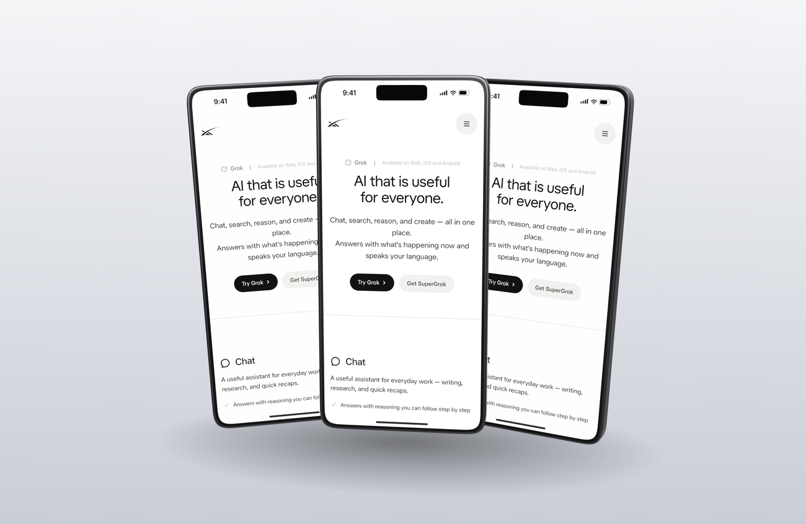
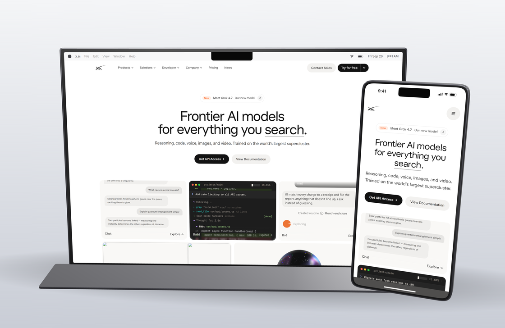
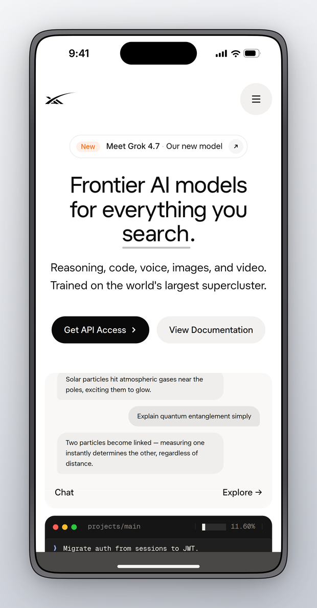
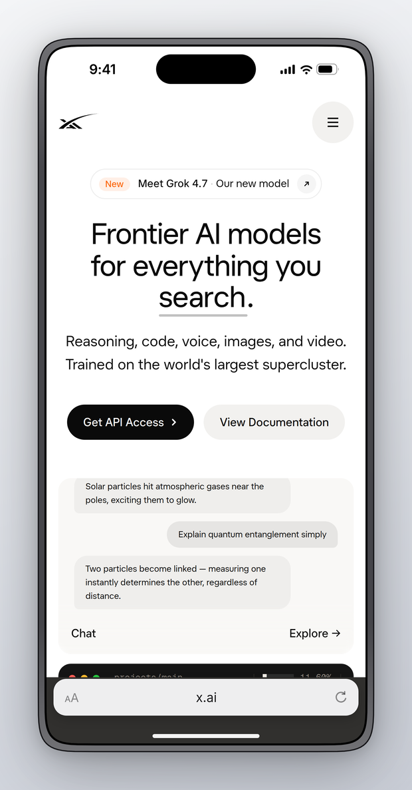
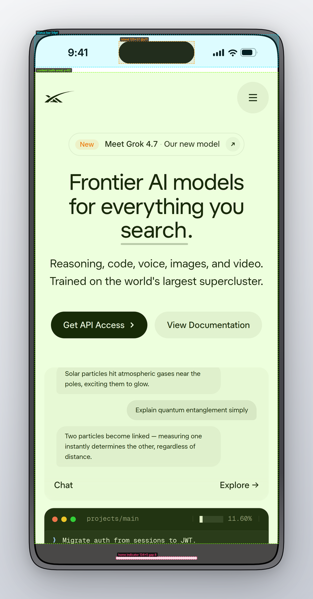

# Plinth

Device mockups of a running app or URL, rendered as real 3D — the
Figma-mockup-plugin workflow without leaving the terminal, driven by
your coding agent, with spec-accurate device geometry.

Each device is built procedurally in three.js from the verified spec
table (extruded continuous-corner body with bevels, titanium edge
material, glass, the island as geometry, optional side buttons — no
vendor 3D assets). The screen is a plane textured with the 2D
compositor's output (page capture + status bar + Safari chrome + home
indicator at native DPR) — that compositor stays the single source of
screen truth. The flat view is the same scene through an orthographic
front camera and is pixel-exact to spec; floating views use a
perspective camera with presets.


## Quick start

```bash
cd skills/plinth && npm install     # playwright-core + three + @fontsource/inter
node scripts/plinth.mjs https://x.ai --device iphone-16-pro --mode app --view hero
node scripts/plinth.mjs https://x.ai --device iphone-16-pro --mode safari              # flat, pixel-exact
node scripts/plinth.mjs shot.png --device iphone-16-pro --view tilt-left               # frame an existing screenshot
```

<p>
  
  
</p>

## Views

`--view flat` (default) renders the orthographic front view —
dimensions, island, indicator and alignment verified on every run.
Floating views: `hero` (three-quarter), `tilt-left` / `tilt-right`,
`top-down`, `fan` (three devices; one device is replicated), `combo`
(largest device centered, phone front-right). Options: `--float <pt>`,
`--transparent`, `--scale 1|2|3`, `--size WxH`, and `--turntable` for a
seamless float/rotate loop (mp4/gif via ffmpeg). Environment light is a
procedural room (PMREM); the contact shadow is a soft blob — both
deterministic, verified by a determinism test.

Requires Node ≥ 18 and an installed Chrome/Chromium (playwright-core
drives it via the `chrome` channel — no browser download; set
`PLINTH_BROWSER=/path/to/chrome` to override; WebGL runs on SwiftShader
where no GPU exists). Dependencies: `playwright-core`, `three`,
`@fontsource/inter`. ffmpeg only for `--scroll`/`--turntable`.

<p>
  
  &nbsp;
  
</p>

All showcase shots are public, logged-out pages (captures run in a
fresh browser context, so there is never a session to leak).

## Phone presentation modes

- **`--mode standalone`** (default): app-style. Plinth draws the iOS
  status bar (9:41, cellular/wifi/battery) and home indicator; the page
  is captured at `height − safe-area-top − safe-area-bottom`, so no
  content ever sits under the island. The safe-area bands are painted
  with the page's own sampled background color, like a real
  safe-area-aware app.
- **`--mode safari`**: mobile Safari. Status bar plus the iOS-18-style
  compact bottom address bar showing the domain, viewport reduced to
  match. (Safari's bar is a dynamic element with no fixed published
  height; drawn as a 50pt pill zone above the 34pt safe area —
  approximation by design.)
- **`--mode bare`**: full-bleed capture under everything (the old
  behavior), island drawn on top. For pages that draw their own mobile
  chrome.

The status bar color scheme follows the page's background luminance
(light content on dark pages), overridable with `--status light|dark`.
The home indicator adapts the same way. Status-bar text renders in
**Inter** (bundled via `@fontsource/inter`): SF Pro cannot be
redistributed, and Inter is the closest freely-licensed metric match.

## Device spec table (all values cited)

Geometry lives in `scripts/devices.mjs` with per-value citations.
Sources: [useyourloaf screen sizes](https://useyourloaf.com/blog/iphone-16-screen-sizes/)
(points, scale, status bar, safe areas), [1440px.com/safe-area](https://1440px.com/safe-area/)
(cross-model safe-area table), measured home-indicator geometry
([134×5pt, 8pt above the edge](https://stackoverflow.com/q/53109069)),
`_displayCornerRadius` collations (55pt / 62pt), island geometry from
public UI kits and simulator shells (124–126×36–37pt @ y≈11 — we use
125×37 and note the ±1pt source disagreement),
[bjango](https://bjango.com/articles/designingmenubarextras/) and
[crestnotch](https://crestnotch.app/macbook-notch-dimensions) for the
MacBook menu bar (37pt) and notch (≈185pt, flagged "derived" there).

| id | viewport (pt) | DPR | safe top/bottom | chrome |
| --- | --- | --- | --- | --- |
| `iphone-16-pro` | 402×874 | 3 | 62 / 34 | island 125×37 @y11, status 54, radius 62, indicator 134×5 |
| `iphone-16` | 393×852 | 3 | 59 / 34 | island, status 54, radius 55 |
| `iphone-15-pro` | 393×852 | 3 | 59 / 34 | island, status 54, radius 55 |
| `pixel-8` | 412×915 | 2.625 | 28 / 24 | punch hole, Android status bar — metrics APPROX |
| `ipad-pro-11` | 834×1194 | 2 | 24 / 20 | status 24, radius 18, indicator width APPROX |
| `macbook-14` | 1512×982 | 2 | menu bar 37 | notch 185×37, macOS-style menu bar |
| `browser` | 1280×800 | 2 | — | Chromium-style tab strip 38 + toolbar 44 (APPROX) |

Values marked APPROX have no authoritative public source (Android
chrome, Safari's dynamic bar, iPad indicator width, browser chrome) and
are drawn from real screenshots; everything else is cited.

Screen corners are **continuous-curvature**: a sampled superellipse
(exponent 4.5) rather than CSS's circular `border-radius`, and the same
squircle path both clips the screenshot and cuts the frame's hole, so
the inner radius matches exactly with no gaps or halos. Side buttons:
`--buttons` (positions approximate).

## Built-in verification (every single-device run, exit 1 on failure)

- capture buffer is exactly the safe-area viewport × DPR;
- output PNG dimensions equal the computed frame+padding size;
- content-center pixel matches the raw capture (alignment);
- the Dynamic Island region is solid black at its spec position;
- the home indicator is present at its spec position.

`scripts/spec-overlay.mjs` draws the cited geometry over any output for
visual review (a real iOS Simulator isn't runnable in a Linux
environment, so the overlay validates against the cited numeric spec):



## Options

```
--device <id>       one device (default iphone-16-pro)
--devices <a,b,c>   multi-device row (composited @2x)
--mode <m>          standalone | safari | bare   (phones/tablets)
--status <s>        auto | light | dark          (status bar content)
--buttons           side buttons on phone frames
--out <file>        output path (.png; .mp4/.gif with --scroll)
--bg <value>        studio | studio-dark | sunset | ocean | none | any CSS
--padding <px>      space around the frame (default 48)
--no-shadow         flat, no drop shadow
--dark              dark color scheme + dark studio background
--frame dark|light  frame body theme
--hide <selectors>  hide elements before capture (cookie banners etc.)
--wait <ms>         extra settle time (default 800)
--scroll            scrolled full-page capture → mp4/gif (ffmpeg)
```

## Tested on (real sites, 2026-09-25)

| Site | Run | Result / findings |
| --- | --- | --- |
| [x.ai](https://x.ai) and public pages (/grok, /api, /news, /company) | app + safari modes, multi-device row, browser frame | All fidelity checks pass; showcase images above come from these runs. Spec overlay confirms region registration. **Finding:** Cloudflare blocks the default HeadlessChrome user agent outright (the block page rendered and dimension checks passed, because a page really did render) — plinth now presents the equivalent stable-Chrome UA, which passes. Always eyeball output on bot-walled sites. |
| vercel.com, app-router.vercel.app, commerce-shopify.vercel.app, github.com | earlier runs | See git history: cookie banner via `--hide`, empty API-backed states, blocked-CDN blank pages — all documented app-state findings, not frame issues. |

Known limitations: multi-device rows composite at @2x (mixed native
DPRs can't share one page); verification is dimensional + pixel
sampling and cannot judge app-level blankness; APPROX metrics listed
above; no authenticated-session capture yet.

## Tests

```bash
cd skills/plinth && npm install && npm test
```

17 tests. The flat-view fidelity assertions run against the 3D
orthographic render (a fixture with edge markers proves no page pixels
under the island/status bar/home indicator, exact content origin,
island blackness at spec coordinates, home-indicator contrast, safari
pill, macOS menu bar + notch, browser chrome, fractional DPR, scroll
mp4). 3D-specific tests: transparent output keeps true alpha (corner
alpha 0, body alpha 255) at the requested canvas size, and rendering is
deterministic — the same input twice differs by a mean pixel distance
under 0.5. Tests self-skip without Chrome.
