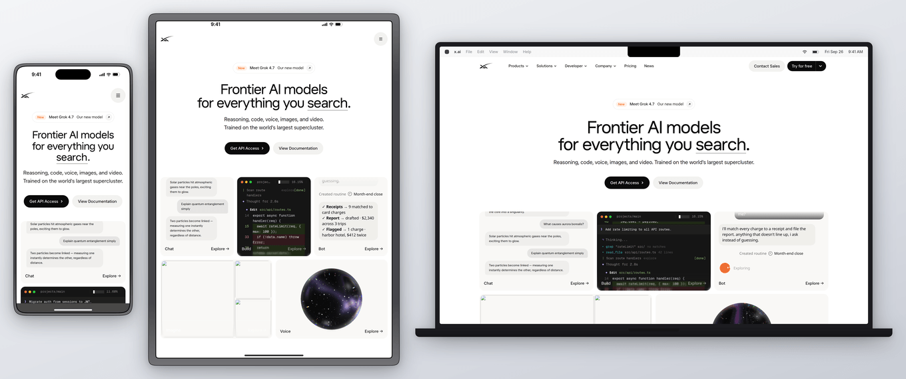

# Plinth

Device-framed, DPR-correct screenshots of a running app or URL, from the
terminal and driven by your coding agent. Plinth captures with Playwright
at the device's **safe-area viewport** (page content never sits under the
Dynamic Island, status bar, or home indicator), draws the device chrome,
and composites at native DPR. Frames and chrome are generated CSS/SVG, not
vendor artwork.



## Quick start

```bash
cd skills/plinth && npm install     # playwright-core + @fontsource/inter
node scripts/plinth.mjs https://x.ai --device iphone-16-pro
node scripts/plinth.mjs https://x.ai --device iphone-16-pro --mode safari
node scripts/plinth.mjs --help      # every flag, default, and exit code
```

Requires Node ≥ 20 and Google Chrome (driven through playwright-core's
`chrome` channel, so nothing is downloaded). For Chromium or a Chrome
in another location, set `PLINTH_BROWSER=/path/to/binary`. `--scroll`
also needs ffmpeg.

<p>
  
  &nbsp;
  
</p>

## Presentation modes (phones and tablets)

- **`standalone`** (default): app-style. The page is captured at
  `height − safe-area-top − safe-area-bottom`. The iOS status bar (9:41,
  cellular, wifi, battery) and the home indicator are drawn on bands in
  the page's dominant edge color, as a safe-area-aware app would show.
- **`safari`** (iPhones only): status bar plus the iOS 18 compact bottom
  address bar showing the host. Safari's bar has no published height;
  it is drawn as a 50pt pill zone above the 34pt safe area.
- **`bare`**: full-bleed capture with the island drawn on top, for pages
  that draw their own mobile chrome.

The status bar and home indicator are light or dark depending on the
page's luminance (override with `--status light|dark`). Chrome text uses
Inter (bundled): SF Pro can't be redistributed.

## How pages are captured

Each run uses a fresh browser context: no cookies or session, and CSP
is bypassed so `--hide` works on strict pages. Browser chrome shows only
the URL's host, never credentials or query strings.

- **User agent:** phones and tablets use touch input (coarse pointer,
  touch points). iPhones send the iOS 18 Safari UA, the Pixel sends an
  Android Chrome UA, and the iPad sends the Mac Safari UA that iPadOS
  uses by default. Desktop frames send the installed Chrome's major
  version.
- **Layout width:** Playwright's `isMobile` is left off. It honors
  `<meta viewport>`, and on pages without that tag it lays out at 980px
  and zooms out, which breaks DPR-exact capture. So pages always lay
  out at the device width, and `'ontouchstart' in window` is false.

## Devices

Every value is cited per line in `scripts/devices.mjs`. APPROX values
have no authoritative source and are drawn from screenshots.

| id | viewport (pt) | DPR | safe top/bottom | chrome |
| --- | --- | --- | --- | --- |
| `iphone-16-pro` | 402×874 | 3 | 62 / 34 | island 125×37 @y11, status 54, radius 62, indicator 134×5 |
| `iphone-16` | 393×852 | 3 | 59 / 34 | island, status 54, radius 55 |
| `iphone-15-pro` | 393×852 | 3 | 59 / 34 | island, status 54, radius 55 |
| `pixel-8` | 412×915 | 2.625 | 28 / 24 | punch hole, Android status bar (APPROX) |
| `ipad-pro-11` | 834×1194 (2018–2022 model) | 2 | 24 / 20 | status 24, radius 18, indicator width APPROX |
| `macbook-14` | 1512×982 | 2 | menu bar 37 | notch 185×37, macOS-style menu bar |
| `browser` | 1280×800 | 2 | — | Chromium-style tab strip 38 + toolbar 44 (APPROX) |

Screen corners are a sampled superellipse (continuous curvature), and
the same path clips the screenshot and cuts the frame's hole, so the
two always line up. `--buttons` adds side buttons. Their positions are
approximate: iPhone buttons go on the left and right, Pixel buttons on
the right.

## Verification

Each single-device still, and frame 0 of a `--scroll` video, prints
`check:` lines:

- the capture is exactly the safe-area viewport × DPR;
- the output size equals frame + padding × DPR;
- a sampled grid of the content matches the capture pixel for pixel. A
  content shift, or a frame covering the screen edge, fails this check;
- each chrome region (status bar, home indicator or Safari bar, menu
  bar, window chrome) differs from the flat band, so missing chrome
  fails.

If every check passes, the file is written to `--out`. If one fails,
the file is kept at `<name>.failed.png` (or `.failed.mp4`/`.gif`).

Exit codes: 0 ok, 1 a check failed, 2 usage error, 3 runtime error
(navigation, browser, ffmpeg).

`scripts/spec-overlay.mjs <output.png> <device> <out.png> [padding] [mode]`
draws the cited geometry over a render for visual review:


## Known limitations

- The checks compare output against the capture, so they can't catch
  page problems: blank or unseeded states, bot walls, cookie banners.
  Look at the image.
- `--scroll` captures the full page once and slides it inside the
  frame. Sticky headers and fixed footers therefore scroll away with the
  content instead of staying pinned, and the safe-area bands keep the
  first screen's colors.
- Multi-device rows composite at @2x, because devices with different
  DPRs can't share one page, and they are not checked.
- No authenticated-session capture.

## Tests

```bash
cd skills/plinth && npm install && npm test
```

The suite renders a local fixture page. It covers edge markers inside
and outside the chrome, the checks catching shifted content and wiped
chrome, frame geometry with `--buttons`, UA and touch emulation, CSP,
URL display, argument errors, exit codes, and scroll output. Browser
tests skip when Chrome can't be launched; set `PLINTH_REQUIRE_BROWSER=1`
to make that a failure (set it in CI).
