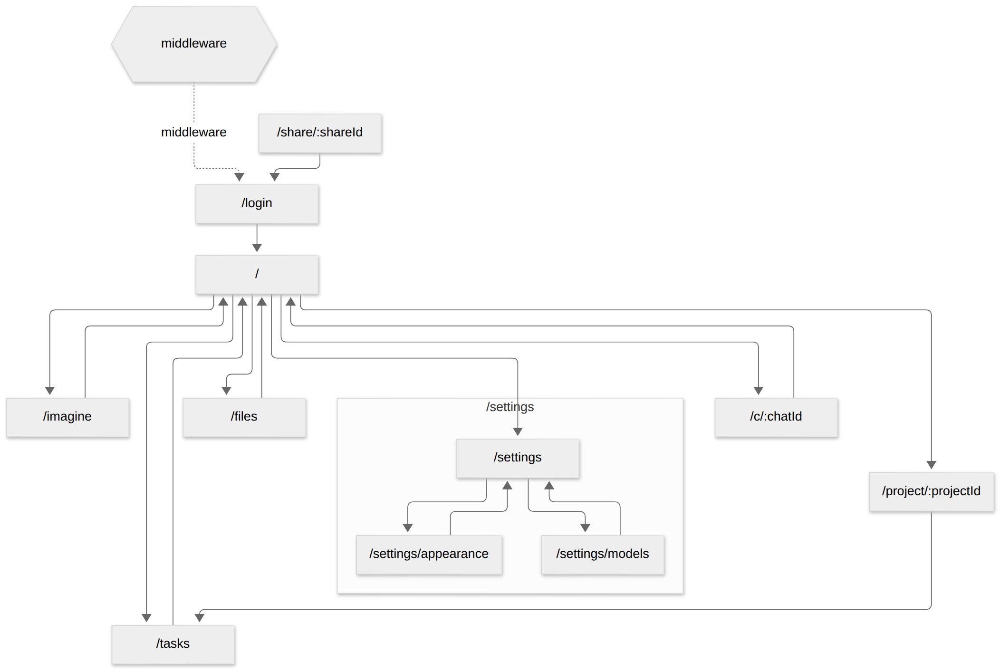
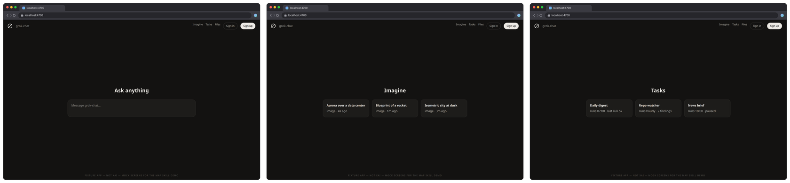
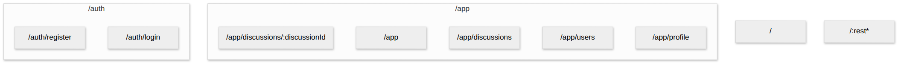

# Ramble

Mermaid user-flow diagrams of the screens that already exist in your
codebase, built from the router by your coding agent, with zero
dependencies.

Every navigation call site becomes an edge or a categorized report
entry with file:line.



Generated from [`fixtures/grok-chat/`](fixtures/grok-chat/), a small
hand-written mock route tree (not xAI code).

## Quick start

```bash
node skills/ramble/scripts/ramble.mjs .          # or a monorepo app dir: apps/web
# → ramble-output/flow.md (Mermaid + report), ramble-output/flow.mmd
```

Output goes under the **current directory**. Node ≥ 18, no
dependencies.

| Flag | Default | |
| --- | --- | --- |
| `--out <dir>` | `ramble-output` | Output directory, relative to the current directory |
| `--include-shared` | off | Draw links from non-route files (layouts, navbars) from one `shared` node |
| `--max-label <n>` | 24 | Truncate next.config edge labels |
| `--thumbs` | off | Screenshot static routes via plinth (needs `--base-url`) |
| `--base-url <url>` | — | Running app for `--thumbs` |
| `--thumb-cap <n>` | 12 | Max screenshots |

Exit codes: 0 ok, 1 unexpected error, 2 usage error (including "no
routers found" and a missing plinth for `--thumbs`).

## What it understands

- **Next.js app router:** route groups `(group)`, dynamic `[param]`,
  catch-all `[...param]`, optional `[[...param]]`, parallel `@slot` and
  intercepting `(.)segment` routes (reported as in-place UI, not
  screens), private `_folders`, `%5F` escapes, `route.*` API handlers
  (counted, not screens), host-based top-level folders
  (`app/app.dub.co/…`), monorepos with several apps. A router must sit
  next to a `package.json` (or in `src/` next to one).
- **Next.js pages router:** nested files, `[param]`; `_app`, `_document`,
  `_error`, `404`/`500`, `.d.ts` and the top-level `api/` excluded. Needs
  a `next` dependency or `next.config.*`, so Vite apps' `src/pages/` and
  MDX content folders are not mistaken for routers.
- **React Router:** `createBrowserRouter` object configs (nested
  `children`, index routes, splats) and `<Routes>`/`<Route path>` JSX
  (nested by tags), including route strings kept in a central `paths`
  config referenced as `paths.x.y.path` (the bulletproof-react pattern).
- **Edges:** `<Link href|to>` (string, template literal, or
  `{ pathname }`), `router.push/replace`, `navigate()`, `redirect()` /
  `permanentRedirect()` (dashed), `middleware.ts`/`proxy.ts`
  `NextResponse.redirect` (dashed, from a middleware node), and each
  app's `next.config` redirects and rewrites (dashed, labeled). Template
  literals (`` `/posts/${id}` ``) match dynamic routes; the most specific
  route wins. JS/TS comments are ignored.
- **Edge sources:** the `page.*` file (app router), the route file
  (pages router), or the route's `element` component imported from a
  relative file (React Router). Other files are "shared", drawn only
  with `--include-shared`. Links resolve within their own app.

The report puts every call site that is not an edge into one category:
**unresolved** (need eyes: `unmatched` targets, `expression` values,
`relative` paths) or **not drawn by design** (`shared`, `external`,
`anchor`, `history`).

Parsing is regex-based (about a second on dub's 197-screen app): it
reads conventions and literals, not arbitrary JavaScript.

## Visual mode (with the plinth skill)

```bash
node skills/ramble/scripts/ramble.mjs . --thumbs --base-url http://localhost:3000
```

Captures static routes through [plinth](../plinth/) into
`flow-visual.md` and `thumbs/r<i>-<slug>.png` (named by diagram node).
plinth must sit next to ramble (`skills/plinth`, with `npm install` run
in it), or set `RAMBLE_PLINTH` to its `scripts/plinth.mjs`. Each app's
`next.config` `basePath` is added to the URL. Failed captures show as ⚠️
cells and don't change the exit code. Demo: the grok-chat fixture served
locally (`node fixtures/grok-chat/serve.mjs`), 8/8 static routes
captured:



## Tested on (real repos)

| Repo | Commit | Result |
| --- | --- | --- |
| [shadcn-ui/taxonomy](https://github.com/shadcn-ui/taxonomy) | `298a885` | 14 screens, 10 edges (2 middleware); MDX `content/pages/` not a router |
| [calcom/cal.com](https://github.com/calcom/cal.com) (`apps/web`) | `54343aa` | 81 screens across hybrid app+pages routers, 56 edges (54 redirect/rewrite/middleware) |
| [dubinc/dub](https://github.com/dubinc/dub) (`apps/web`) | `3c88d01` | 197 screens in host-based apps, 518 API handlers; symlinked `(ee)/LICENSE.md` handled |
| [alan2207/bulletproof-react](https://github.com/alan2207/bulletproof-react) (`apps/react-vite`) | `9506629` | 9 routes via its central `paths` config; its `getHref()` links are reported as expressions |
| [vercel/app-playground](https://github.com/vercel/app-playground) | `b5c0f7e` | 37 screens; 6 parallel-slot pages kept out of URLs |

Sample outputs:

<p>
  
  
</p>

## Known limitations

- SvelteKit, Remix and Expo Router are not implemented.
- Navigation through a router object not named `router` (`const r =
  useRouter(); r.push(…)`) or through `window.location` is not seen.
- React Router: elements defined in the router file itself, or anything
  but a plain imported component, leave the route without a source file;
  their links count as shared.
- next.config: only literal `source`/`destination` strings; `has` /
  `missing` conditions are ignored.
- `[locale]` segments appear as one dynamic param, not one per locale.
- Raw `<a href>` values that include the basePath show as unmatched
  (Next's `<Link>` omits it, which is what ramble expects).
- `--thumbs` uses one `--base-url` for every app; run it on one app.

## Tests

```bash
node --test skills/ramble/scripts/ramble.test.mjs
```
